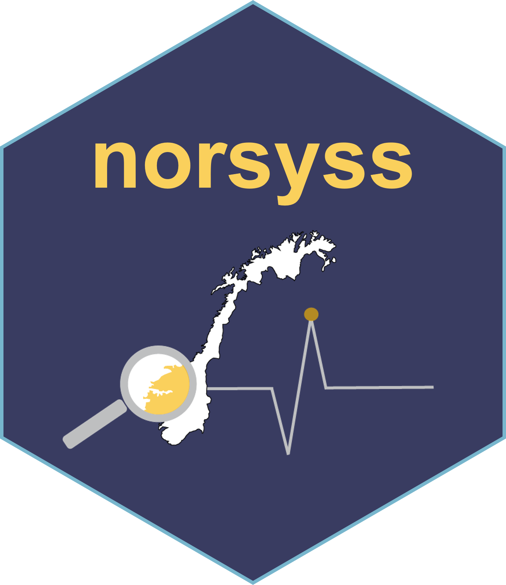

# norsyss 

English text follows below.

## Norsk

Det norske syndromovervåkingssystemet (NorSySS) er eit overvåkingssystem for infeksjonssjukdomar basert på konsultasjonar med allmennpraktiserande legar og legevakt.

Formålet med NorSySS er å kunne oppdage utbrot av infeksjonssjukdomar så tidleg som mogleg slik at smitteverntiltak kan implementerast. NorSySS vil også kunne beskrive førekomsten av infeksjonssjukdomar i landet, i fylke og kommunar slik at kommunelegar kan gjennomføre smitteverntiltak og sjå effekten av tiltak.

NorSySS viser talet på konsultasjonar med ein diagnose hjå landets allmennpraktiserande legar og legevakt. NorSySS viser difor trender og mogelege utbrot av sjukdom som fører til at fleire kontaktar legen. Tala indikerer ikkje kor mange personar som har ein bestemt diagnose i befolkninga, sidan same person kan gå til legen fleire gonger med same diagnose, og andre går ikkje til legen i det heile tatt. Diagnosen som blir stilt på legekontor og legevakt er basert på pasientens symptom. Diagnosen blir som regel ikkje bekrefta med ein laboratorieundersøking.

NorSySS si datakjelde er KUHR (Kontroll og utbetaling av helserefusjon), som er eit system som administrerer refusjonskrav frå helsepersonell og institusjonar til staten (HELFO) i Noreg. Systemet er eigd av Helsedirektoratet. KUHR er eit system innanfor KPR (Kommunalt pasient- og brukarregister) som inneheld data frå kommunane om personar som har søkt, mottek eller har motteke helse- og omsorgstenester.

NorSySS nyttar ICPC-2-koder for å fastsetje årsaken til kontakt med helseinstitusjonen. ICPC-2-koder er eit klassifikasjonssystem utvikla av World Organization of Family Doctors for å fange opp og ordne klinisk informasjon i primærhelsetenesta. Det er formelt anerkjent av Verds helseorganisasjon og er kartlagt til International Classification of Diseases (ICD). ICPC er delt inn i 17 kapittel etter kroppssystem, og det tillèt registrering av behandlingsforløp over tid. Det er utvikla for å gjenspegle innhaldet i primærhelsetenesta og er tilgjengeleg på fleire språk. ICPC-2-koder er eit supplement til ICD, og gir ei meiningsfull detaljnivå for primærhelsetenesta. ICPC-2 fangar ikkje ein diagnose i seg sjølv, men heller årsaka til pasientens oppmøte eller besøk hos helsepersonell. Dette skuldast at i primærhelsetenesta kan pasientens symptom og plagene ikkje alltid føre til ein endeleg diagnose, og helsepersonellet kan ha behov for å overvake pasienten over tid eller henvise til vidare testing eller spesialistbehandling. ICPC-2-systemet er utforma for å gjenspegle innhaldet i primærhelsetenesta og tillate registrering av behandlingsforløp over tid, uavhengig av om ein endeleg diagnose er stilt.

## English 

The Norwegian Syndromic Surveillance System (NorSySS) is a surveillance system of infectious diseases based on consultations with general practitioners and out-of-hours primary care facilities

The purpose of NorSySS is to be able to detect outbreaks of infectious diseases as early as possible so that infection control measures can be implemented. NorSySS will also be able to describe the prevalence of infectious diseases in the country, in counties and municipalities so that the municipal health authorities can carry out infection control measures and see the effect of measures.

NorSySS shows how many consultations there have been with a diagnosis at the country's general practitioners and out-of-hours primary care facilities. NorSySS therefore shows trends and possible outbreaks of disease which lead to more people contacting the doctor. The figures do not indicate how many people have a certain diagnosis in the population, as the same person can go to the doctor several times with the same diagnosis, and others do not go to the doctor at all. The diagnosis made in doctors' offices and the out-of-hours primary care facilities is based on the patient's symptoms. Most often, the diagnosis is not confirmed with a laboratory examination.

NorSySS' data source is KUHR (Control and Payment of Health Reimbursements), which is a system that manages reimbursement claims from healthcare providers and institutions to the state (HELFO) in Norway. The system is owned by the Norwegian Directorate of Health. KUHR is a system within KPR (Municipal Patient and User Register) that contains data from municipalities about individuals who have applied for, receive, or have received health and care services.

NorSySS uses ICPC-2 codes from KUHR to determine the reason for contacting the healthcare facility. ICPC-2 codes are a classification system developed by the World Organization of Family Doctors to capture and order clinical information in primary care. It is formally recognized by the World Health Organization and is mapped to the International Classification of Diseases (ICD). ICPC is divided into 17 chapters by body systems, and it allows the capture of episodes of care over time. It is designed to reflect the content of primary care and is available in multiple languages. ICPC-2 codes are complementary to ICD, providing a meaningful level of detail for primary care. ICPC-2 does not capture a diagnosis per se, but rather the reason for the patient's encounter or visit to the healthcare provider. This is because in primary care, a patient's symptoms and complaints may not always lead to a definitive diagnosis, and the healthcare provider may need to monitor the patient over time or refer them for further testing or specialist care. The ICPC-2 system is designed to reflect the content of primary care and allow for the capture of episodes of care over time, regardless of whether a definitive diagnosis has been made.

