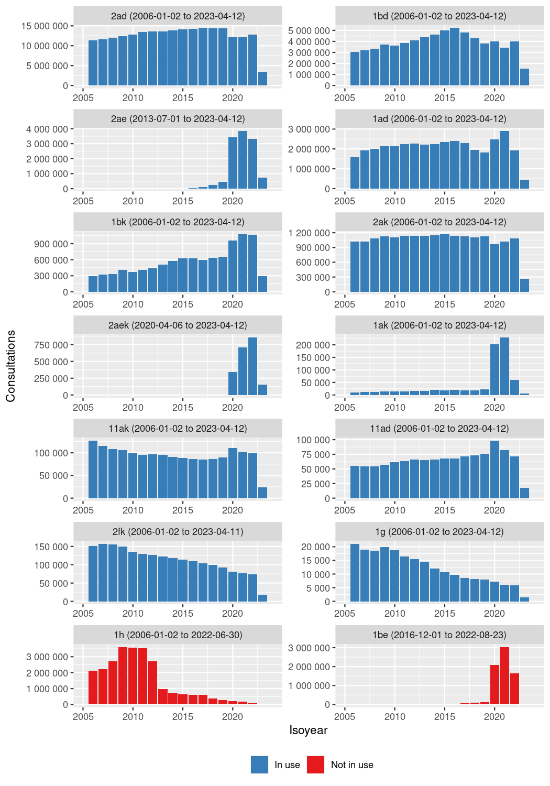

https://lovdata.no/dokument/SF/forskrift/2022-06-29-1269

https://www.helsedirektoratet.no/statistikk/om-data-statistikk-om-fastlegetjenesten

<!--html_preserve-->

<table class="gt_table">
  <thead class="gt_header">
    <tr>
      <td colspan="2" class="gt_heading gt_title gt_font_normal" style>Tariff codes in NorSySS</td>
    </tr>
    <tr>
      <td colspan="2" class="gt_heading gt_subtitle gt_font_normal gt_bottom_border" style>Norwegian bokmål</td>
    </tr>
  </thead>
  
  <tbody class="gt_table_body">
    <tr class="gt_group_heading_row">
      <th colspan="2" class="gt_group_heading" scope="colgroup" id="Konsultasjon/sykebesøk (tilstede) (&quot;p&quot;)">Konsultasjon/sykebesøk (tilstede) ("p")</th>
    </tr>
    <tr class="gt_row_group_first"><th id="stub_1_1" scope="row" class="gt_row gt_left gt_stub">11ad</th>
<td headers="Konsultasjon/sykebesøk (tilstede) ("p") stub_1_1 tariffraw_description_nb" class="gt_row gt_left">Sykebesøk ved allmennpraktiserende lege (dag).</td></tr>
    <tr><th id="stub_1_2" scope="row" class="gt_row gt_left gt_stub">11ak</th>
<td headers="Konsultasjon/sykebesøk (tilstede) ("p") stub_1_2 tariffraw_description_nb" class="gt_row gt_left">Sykebesøk ved allmennpraktiserende lege (kveld).</td></tr>
    <tr><th id="stub_1_3" scope="row" class="gt_row gt_left gt_stub">2ad</th>
<td headers="Konsultasjon/sykebesøk (tilstede) ("p") stub_1_3 tariffraw_description_nb" class="gt_row gt_left">Konsultasjon hos allmennpraktiserende lege (dag).</td></tr>
    <tr><th id="stub_1_4" scope="row" class="gt_row gt_left gt_stub">2ak</th>
<td headers="Konsultasjon/sykebesøk (tilstede) ("p") stub_1_4 tariffraw_description_nb" class="gt_row gt_left">Konsultasjon hos allmennpraktiserende lege (kveld).</td></tr>
    <tr><th id="stub_1_5" scope="row" class="gt_row gt_left gt_stub">2fk</th>
<td headers="Konsultasjon/sykebesøk (tilstede) ("p") stub_1_5 tariffraw_description_nb" class="gt_row gt_left">Konsultasjon og tillegg for utrykning til kontor ved øyeblikkelig hjelp under legevakt når skyssmiddel er benyttet, for første pasient. Det kan i tillegg beregnes reisetillegg og skyssgodtgjørelse. Taksten kan ikke benyttes ved tilstedevakt.</td></tr>
    <tr class="gt_group_heading_row">
      <th colspan="2" class="gt_group_heading" scope="colgroup" id="E-konsultasjon (&quot;e&quot;)">E-konsultasjon ("e")</th>
    </tr>
    <tr class="gt_row_group_first"><th id="stub_1_6" scope="row" class="gt_row gt_left gt_stub">2ae</th>
<td headers="E-konsultasjon ("e") stub_1_6 tariffraw_description_nb" class="gt_row gt_left">E-konsultasjon hos fastlege og på legevakt (dag).</td></tr>
    <tr><th id="stub_1_7" scope="row" class="gt_row gt_left gt_stub">2aek</th>
<td headers="E-konsultasjon ("e") stub_1_7 tariffraw_description_nb" class="gt_row gt_left">E-konsultasjon hos fastlege og på legevakt (kveld).</td></tr>
    <tr class="gt_group_heading_row">
      <th colspan="2" class="gt_group_heading" scope="colgroup" id="Enkelt kontakt (&quot;s&quot;)">Enkelt kontakt ("s")</th>
    </tr>
    <tr class="gt_row_group_first"><th id="stub_1_8" scope="row" class="gt_row gt_left gt_stub">1ad</th>
<td headers="Enkelt kontakt ("s") stub_1_8 tariffraw_description_nb" class="gt_row gt_left">Enkel pasientkontakt ved personlig frammøte eller ved bud. Taksten forutsetter at det gis råd/veiledning. Gjelder også når kontakten/forespørselen resulterer i skriving av resept, sykmelding, rekvisisjon eller henvisning (dag).</td></tr>
    <tr><th id="stub_1_9" scope="row" class="gt_row gt_left gt_stub">1ak</th>
<td headers="Enkelt kontakt ("s") stub_1_9 tariffraw_description_nb" class="gt_row gt_left">Enkel pasientkontakt ved personlig frammøte eller ved bud. Taksten forutsetter at det gis råd/veiledning. Gjelder også når kontakten/forespørselen resulterer i skriving av resept, sykmelding, rekvisisjon eller henvisning (kveld).</td></tr>
    <tr><th id="stub_1_10" scope="row" class="gt_row gt_left gt_stub">1bd</th>
<td headers="Enkelt kontakt ("s") stub_1_10 tariffraw_description_nb" class="gt_row gt_left">Enkel pasientkontakt skriftlig, per telefon eller ved elektronisk kommunikasjon. Taksten forutsetter at det gis råd/veiledning. Gjelder også når kontakten/forespørselen resulterer i skriving av resept sykmelding, rekvisisjon eller henvisning (dag).</td></tr>
    <tr><th id="stub_1_11" scope="row" class="gt_row gt_left gt_stub">1bk</th>
<td headers="Enkelt kontakt ("s") stub_1_11 tariffraw_description_nb" class="gt_row gt_left">Enkel pasientkontakt skriftlig, per telefon eller ved elektronisk kommunikasjon. Taksten forutsetter at det gis råd/veiledning. Gjelder også når kontakten/forespørselen resulterer i skriving av resept sykmelding, rekvisisjon eller henvisning (kveld).</td></tr>
    <tr><th id="stub_1_12" scope="row" class="gt_row gt_left gt_stub">1be</th>
<td headers="Enkelt kontakt ("s") stub_1_12 tariffraw_description_nb" class="gt_row gt_left">Enkel pasientkontakt ved elektronisk kommunikasjon. Taksten er utgått 1. juli 2022, og inkludert i takst 1bd.</td></tr>
    <tr><th id="stub_1_13" scope="row" class="gt_row gt_left gt_stub">1g</th>
<td headers="Enkelt kontakt ("s") stub_1_13 tariffraw_description_nb" class="gt_row gt_left">Enkel pasientkontakt, forespørsel, rådgivning per telefon mellom kl. 23 og 08. Taksten kan bare benyttes under legevakt i vaktdistrikt uten tilstedevakt.</td></tr>
    <tr><th id="stub_1_14" scope="row" class="gt_row gt_left gt_stub">1h</th>
<td headers="Enkelt kontakt ("s") stub_1_14 tariffraw_description_nb" class="gt_row gt_left">Sykemelding og henvisning uten pasient tilstede.</td></tr>
  </tbody>
  
  
</table>

<!--/html_preserve-->

<!--html_preserve-->

<table class="gt_table">
  <thead class="gt_header">
    <tr>
      <td colspan="2" class="gt_heading gt_title gt_font_normal" style>Tariff codes in NorSySS</td>
    </tr>
    <tr>
      <td colspan="2" class="gt_heading gt_subtitle gt_font_normal gt_bottom_border" style>English</td>
    </tr>
  </thead>
  
  <tbody class="gt_table_body">
    <tr class="gt_group_heading_row">
      <th colspan="2" class="gt_group_heading" scope="colgroup" id="Consultation/visit (in person) (&quot;p&quot;)">Consultation/visit (in person) ("p")</th>
    </tr>
    <tr class="gt_row_group_first"><th id="stub_1_1" scope="row" class="gt_row gt_left gt_stub">11ad</th>
<td headers="Consultation/visit (in person) ("p") stub_1_1 tariffraw_description_en" class="gt_row gt_left">Home visit by a general practitioner (day).</td></tr>
    <tr><th id="stub_1_2" scope="row" class="gt_row gt_left gt_stub">11ak</th>
<td headers="Consultation/visit (in person) ("p") stub_1_2 tariffraw_description_en" class="gt_row gt_left">Home visit by a general practitioner (night).</td></tr>
    <tr><th id="stub_1_3" scope="row" class="gt_row gt_left gt_stub">2ad</th>
<td headers="Consultation/visit (in person) ("p") stub_1_3 tariffraw_description_en" class="gt_row gt_left">Consultation with a general practitioner (day).</td></tr>
    <tr><th id="stub_1_4" scope="row" class="gt_row gt_left gt_stub">2ak</th>
<td headers="Consultation/visit (in person) ("p") stub_1_4 tariffraw_description_en" class="gt_row gt_left">Consultation with a general practitioner (night).</td></tr>
    <tr><th id="stub_1_5" scope="row" class="gt_row gt_left gt_stub">2fk</th>
<td headers="Consultation/visit (in person) ("p") stub_1_5 tariffraw_description_en" class="gt_row gt_left">Consultation and supplement for being called to the office for immediate help during the emergency room when an ambulance has been used, for the first patient. Travel allowances and transport allowances can also be calculated. The tariff cannot be used for on-call duty.</td></tr>
    <tr class="gt_group_heading_row">
      <th colspan="2" class="gt_group_heading" scope="colgroup" id="E-Consultation (&quot;e&quot;)">E-Consultation ("e")</th>
    </tr>
    <tr class="gt_row_group_first"><th id="stub_1_6" scope="row" class="gt_row gt_left gt_stub">2ae</th>
<td headers="E-Consultation ("e") stub_1_6 tariffraw_description_en" class="gt_row gt_left">E-consultation with a GP and at the emergency room (day).</td></tr>
    <tr><th id="stub_1_7" scope="row" class="gt_row gt_left gt_stub">2aek</th>
<td headers="E-Consultation ("e") stub_1_7 tariffraw_description_en" class="gt_row gt_left">E-consultation with a GP and at the emergency room (night).</td></tr>
    <tr class="gt_group_heading_row">
      <th colspan="2" class="gt_group_heading" scope="colgroup" id="Simple contact (&quot;s&quot;)">Simple contact ("s")</th>
    </tr>
    <tr class="gt_row_group_first"><th id="stub_1_8" scope="row" class="gt_row gt_left gt_stub">1ad</th>
<td headers="Simple contact ("s") stub_1_8 tariffraw_description_en" class="gt_row gt_left">Simple patient contact by personal attendance or by delivery. The rate assumes that advice/guidance is given. Also applies when the contact/request results in the writing of a prescription, sick leave, requisition or referral (day).</td></tr>
    <tr><th id="stub_1_9" scope="row" class="gt_row gt_left gt_stub">1ak</th>
<td headers="Simple contact ("s") stub_1_9 tariffraw_description_en" class="gt_row gt_left">Simple patient contact by personal attendance or by delivery. The rate assumes that advice/guidance is given. Also applies when the contact/request results in the writing of a prescription, sick leave, requisition or referral (night).</td></tr>
    <tr><th id="stub_1_10" scope="row" class="gt_row gt_left gt_stub">1bd</th>
<td headers="Simple contact ("s") stub_1_10 tariffraw_description_en" class="gt_row gt_left">Simple patient contact in writing, by telephone or by electronic communication. The rate assumes that advice/guidance is given. Also applies when the contact/request results in the writing of a prescription sick note, requisition or referral (day).</td></tr>
    <tr><th id="stub_1_11" scope="row" class="gt_row gt_left gt_stub">1bk</th>
<td headers="Simple contact ("s") stub_1_11 tariffraw_description_en" class="gt_row gt_left">Simple patient contact in writing, by telephone or by electronic communication. The rate assumes that advice/guidance is given. Also applies when the contact/request results in the writing of a prescription sick note, requisition or referral (night).</td></tr>
    <tr><th id="stub_1_12" scope="row" class="gt_row gt_left gt_stub">1be</th>
<td headers="Simple contact ("s") stub_1_12 tariffraw_description_en" class="gt_row gt_left">Simple patient contact through electronic communication. The rate has expired on 1 July 2022, and included in rate 1bd.</td></tr>
    <tr><th id="stub_1_13" scope="row" class="gt_row gt_left gt_stub">1g</th>
<td headers="Simple contact ("s") stub_1_13 tariffraw_description_en" class="gt_row gt_left">Easy patient contact, enquiries, counseling by telephone between 23 and 08. The rate can only be used during emergency care in an on-call district without an on-call presence.</td></tr>
    <tr><th id="stub_1_14" scope="row" class="gt_row gt_left gt_stub">1h</th>
<td headers="Simple contact ("s") stub_1_14 tariffraw_description_en" class="gt_row gt_left">Sick leave and referral without patient present.</td></tr>
  </tbody>
  
  
</table>

<!--/html_preserve-->

